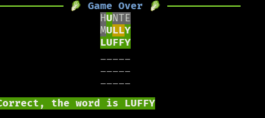

# Pyrdle
This is a wordle clone for terminal written in python
this is a project from the

# Learn
- today i get to know about the doctest module in python
  - it can be run using the `python -m doctest -v filename.py`
- `-m` after python runs the module after it as a script

# Complete Game
